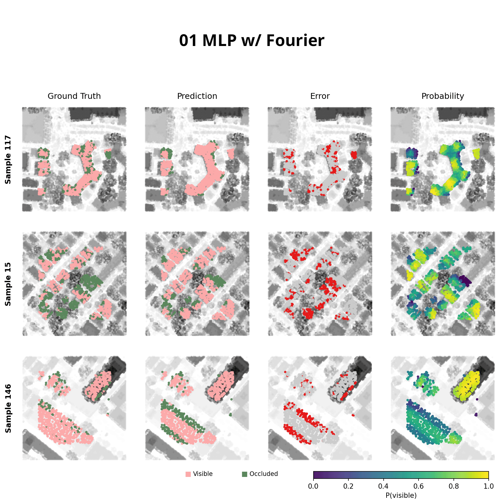

# PointPROP

Parallel Ray Occlusion Prediction for Point Clouds

## Overview

PointPROP is a deep learning–based surrogate model for **point-in-time solar ray occlusion** directly on **urban LiDAR point clouds**.  
Given:

- a **context point cloud** `pts_context ∈ ℝ^{N×3}`,
- a set of **test points** `pts_test ∈ ℝ^{M×3}`, and
- a **solar ray direction** `ray ∈ ℝ^3`,

the model predicts whether each test point is **occluded or visible** along that ray.

Formally, we learn a binary classifier:

$$
f(\text{pts}_{\text{context}},\, \text{pts}_{\text{test}},\, \text{ray}) \in \{0,1\}^M
$$

  

## Motivation

PointPROP aims to learn a **neural surrogate** that directly predicts ray occlusion from raw point clouds as motivated by point-in-time solar occulsion testing at urban scale.

## Key Ideas

- Treat **ray occlusion** as a **physics-governed, geometry-dependent function**, not a semantic task.
- Explicitly design **inductive biases** that reflect:
  - local geometric structure,
  - global scene configuration,
  - directional constraints (solar vector).
- Compare multiple architectural families:
  - **Global MLP head** (PointNet-style pooling)
  - **Transformer cross-attention head**
  - **MLP + local k-NN neighborhood pooling** (PointNet++-style)

## Data

- Source: **Urban-scale LiDAR** point clouds, partitioned into fixed-size sub-patches.  
- For each sub-patch, we extract:
  1. **Context points** (surrounding geometry)
  2. **Test points** (query locations)
  3. **Solar ray direction** (sampled from a hemispherical sky dome)
  4. **Binary occlusion labels** (visible = 1, occluded = 0)

- Ground truth generated via a **voxelization-based simulation**:
  - Point cloud → 3D occupancy grid  
  - Ray–voxel intersection to determine occlusion

- Dataset size:
  - 123 sub-patches × 16 rays per patch = **1,968 samples**
  - Split: **1,377 train / 393 val / 198 test**

## Model Architecture

### Encoders

- **Point cloud encoder**  
  - RandLA-Net–style encoder (without decoder)
  - Random downsampling + Local Feature Aggregation (LFA)
  - Produces per-point features + downsampled coordinates for **context** and **test** clouds.

- **Positional encoder** (`PtPositionEncoder`)  
  - MLP with optional **Fourier positional encoding** of 3D coordinates.

- **Solar encoder** (`Solar_Embed`)  
  - MLP with low-frequency Fourier embedding of the **solar direction**.

### Heads

We implement three heads over the shared latent space:

1. **ShadingSurrogateMLP (Global-Only)**
   - Fuse solar direction into context features (concat / gated / add).
   - Global mean & max pooling over context → **scene descriptor**.
   - Broadcast descriptor to test points and pass through MLP to predict occlusion.

2. **ShadingSurrogateTransformer (Cross-Attention)**
   - Fuse solar into context features as above.
   - Multi-Head Attention:
     - Queries: test-point features  
     - Keys/Values: solar-conditioned context features  
   - Attention output → MLP → per-point logits.

3. **ShadingSurrogateMLPV2 (Global + Local)**
   - Global branch as in MLP head.
   - Local branch:
     - For each test point, find k-NN in context.
     - Encode **relative positions** and neighbor features via shared MLP.
     - Pool (mean + max) over neighbors → local descriptor.
   - Concatenate:
     - test-point feature + local feature + global feature → MLP → logits.

All heads are trained with **BCE-with-logits loss**.

